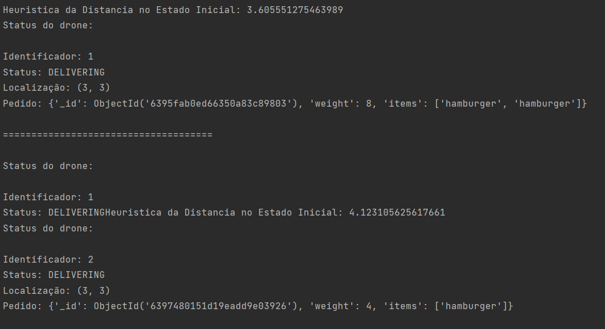
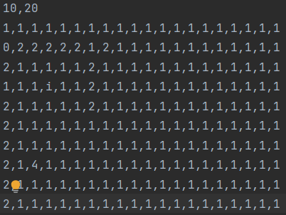
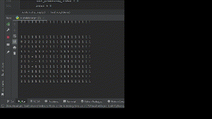
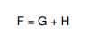
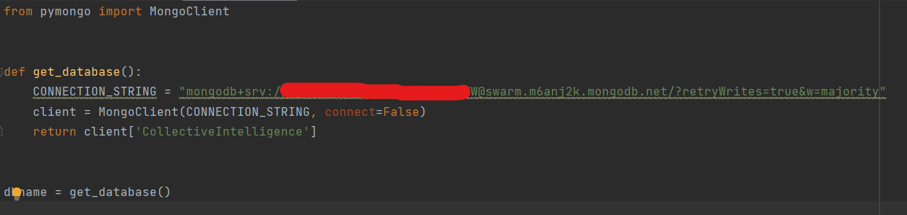
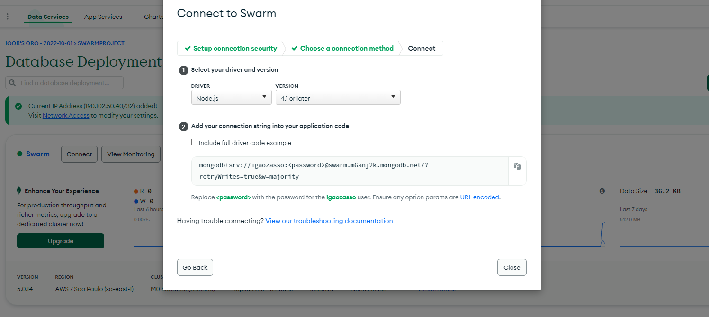

<!-- Improved compatibility of back to top link: See: https://github.com/othneildrew/Best-README-Template/pull/73 -->
<a name="readme-top"></a>
<!--
*** Thanks for checking out the Best-README-Template. If you have a suggestion
*** that would make this better, please fork the repo and create a pull request
*** or simply open an issue with the tag "enhancement".
*** Don't forget to give the project a star!
*** Thanks again! Now go create something AMAZING! :D
-->

<!-- PROJECT SHIELDS -->
<!--
*** I'm using markdown "reference style" links for readability.
*** Reference links are enclosed in brackets [ ] instead of parentheses ( ).
*** See the bottom of this document for the declaration of the reference variables
*** for contributors-url, forks-url, etc. This is an optional, concise syntax you may use.
*** https://www.markdownguide.org/basic-syntax/#reference-style-links
-->
[![Forks][forks-shield]][forks-url]
[![Stargazers][stars-shield]][stars-url]
[![Issues][issues-shield]][issues-url]
[![MIT License][license-shield]][license-url]
[![LinkedIn][linkedin-shield]][linkedin-url]

<br />
<div align="center">

  <h3 align="center">Collective Intelligence</h3>

  <p align="center">
    Universo simulado de drones autônomos!
    <br />
  </p>
</div>

<!-- ABOUT THE PROJECT -->
## Sobre o projeto

O objetivo deste código é criar um universo onde será possível simular o funcionamento de drones autônomos capazes de 
realizar tarefas definidas pelo usuário, de forma inteligente e otimizada. Na primeira etapa do projeto foi definido que 
o exemplo utilizado seria de um sistema de delivery para uma lanchonete que precisa realizar suas entregas de forma eficiente.

Para simular o funcionamento de dois agentes atuando ao mesmo tempo foi utilizado o conceito de Threads, onde é possível realizar o processamento duas ou mais tarefas simultaneamente.

A primeira etapa do projeto são os registros de cada pedido que chega ao estabelecimento. Esse registro é feito no MongoDB, um banco de dados não relacional.
Após os registros serem feitos, o núcleo da aplicação realiza uma busca no banco de dados, e armazena os itens cadastrados em uma fila, que será consumida por cada agente disponível para operação.
Os agentes apresentados no simulador realizam um cálculo com base no algoritmo A* para encontrar o melhor percurso até o local de destino, e refazer o caminho até a origem (estabelecimento comercial).

Durante todas as etapas citadas, o algoritmo emite um relatório com as informações de cada agente, incluindo: localização, qual pedido está sendo entregue e qual o status do agente em questão.



Como citado anteriormente, o sistema realiza o cálculo do melhor percurso utilizando o algoritmo A*, que será detalhado nas próximas seções.

## Funcionamento do algoritmo

O arquivo principal do projeto inicia fazendo a leitura de um arquivo ".csv", que possui uma série de valores separados por vírgula. A leitura deste arquivo gera uma matriz cuja dimensão é definida no topo deste mesmo arquivo ".csv", e esta matriz é o plano em que ocorrem os eventos principais do sistema, como a representação gráfica dos agentes transitando para realização das entregas, a representação dos locais de entrega e a representação do estabelecimento onde é a origem dos agentes.



Após todas essas definições acerca do universo que o sistema está gerando, foi utilizado o conceito de Threads para representar mais de um agente realizando ações de forma simultânea. A Thread é uma forma como um processo de um programa de computador é divido em duas ou mais tarefas que podem ser executadas concorrentemente, e este conceito está totalmente de acordo com o objetivo citado acima: representar mais de um agente realizando ações concomitantes.

Com os agentes preparados para operar, o sistema começa a calcular o melhor trajeto até o ponto definido para entrega, e realiza o mesmo cálculo para retorno. Enquanto a execução do sistema está em andamento, um relatório está sendo exibido para monitorar cada passo dos agentes definidos para executar as tarefas. Esses relatórios incluem: id, peso (que neste caso está relacionado com a prioridade do pedido) e os itens do pedido.



## Algoritmo A*

A* é um algoritmo para planejamento de trajetórias em um grid contendo o destino, caminhos livres e obstáculos. Sendo amplamente utilizado para encontrar o caminho mais curto (aproximação), de uma maneira rápida e inteligente. Esse é um algoritmo guloso, em cada iteração ele faz a escolha que parece ser a melhor possível de acordo com algum critério, no caso deste sistema, o critério é a minimização da função heurística h. A função heurística é uma “dica” para o algoritmo
ter um norte e poder decidir quando preferir visitar um estado a outro. Podemos entender como estado, cada ponto do nosso plano.

Os agentes iniciam do ponto (3,3), que representa o local do estabelecimento no qual os pedidos são enviados. No início da execução, os pontos adjacentes são verificados, e geralmente procurando para fora até que o destino seja encontrado. O ponto de partida (3,3) é adicionado a uma "lista aberta" de pontos a serem considerados. Todos os pontos alcançáveis que podem ser passados por e sejam adjacentes ao ponto de
partida são verificados, ignorando ambientes ilegais (representados pelo número 2 no plano), e sendo adicionados à lista aberta. Para
cada um destes pontos, a origem (3,3) é salva como o nó pai. Este ponto do nó pai é muito importante quando for necessário localizar o caminho. O ponto (3,3) é removido da lista aberta, e acrescentado a lista fechada de pontos que não possuem a necessidade de serem verificados novamente

Nesta etapa, um dos pontos adjacentes da lista aberta é selecionado e o processo anterior é repetido, agora sem o ponto de origem, pois agora o agente está em um novo estado. A chave para determinar quais pontos utilizar enquanto a busca estiver sendo executada é a seguinte equação:



onde

* G = custo do movimento para se ir do ponto de início até o ponto determinado na malha
seguindo o caminho criado para chegar lá;
* H = é o custo estimado do movimento para percorrer daquele ponto determinado até o destino final, ponto
B. Isto é frequentemente referido como a heurística. Recebe este nome porque isto é uma adivinhação. Não sabemos a distância real entre os
pontos até que encontremos o caminho, isto porque podemos ter todos os tipos de coisas no caminho
(prédios, fios, postes de luz, estruturas, etc). Neste projeto foi utilizada uma forma para calcular H, porém existem muitas outras formas de chegar ao mesmo resultado.

O caminho é gerado passando repetidamente pela lista aberta e escolhendo o ponto com a mais
baixa contagem de F.

<p align="right">(<a href="#readme-top">back to top</a>)</p>

### Ferramentas utilizadas

* [![Python][Python.org]][python-url]
* [![Mongo][mongo-shield]][mongo-url]

<p align="right">(<a href="#readme-top">back to top</a>)</p>

### Instalação

1.Clone o repositório
   ```sh
   git clone https://github.com/your_username_/Project-Name.git
   ```

2. Configure o MongoDB criando um usuário e senha para acesso ao banco de dados;

3. Crie uma coleção no MongoDB;

4. Crie a base de dados no Mongo DB;

5. Crie uma classe para conexão conforme o exemplo:



6. Para conseguir a string de conexão, siga a documentação do próprio MongoDB conforme a imagem sugere:



<p align="right">(<a href="#readme-top">back to top</a>)</p>

<!-- LICENSE -->
## Licença

Distributed under the MIT License. See `LICENSE.txt` for more information.

<p align="right">(<a href="#readme-top">back to top</a>)</p>

<!-- CONTACT -->
## Contato

Igor Molina - (https://www.linkedin.com/in/igor-m-364748b6/) - igordsmolina@gmail.com

Project Link: [https://github.com/your_username/repo_name](https://github.com/your_username/repo_name)

<p align="right">(<a href="#readme-top">back to top</a>)</p>

<!-- MARKDOWN LINKS & IMAGES -->
<!-- https://www.markdownguide.org/basic-syntax/#reference-style-links -->
[forks-shield]: https://img.shields.io/github/forks/othneildrew/Best-README-Template.svg?style=for-the-badge
[forks-url]: https://github.com/othneildrew/Best-README-Template/network/members
[stars-shield]: https://img.shields.io/github/stars/othneildrew/Best-README-Template.svg?style=for-the-badge
[stars-url]: https://github.com/othneildrew/Best-README-Template/stargazers
[issues-shield]: https://img.shields.io/github/issues/othneildrew/Best-README-Template.svg?style=for-the-badge
[issues-url]: https://github.com/othneildrew/Best-README-Template/issues
[license-shield]: https://img.shields.io/github/license/othneildrew/Best-README-Template.svg?style=for-the-badge
[license-url]: https://github.com/othneildrew/Best-README-Template/blob/master/LICENSE.txt
[linkedin-shield]: https://img.shields.io/badge/-LinkedIn-black.svg?style=for-the-badge&logo=linkedin&colorB=555
[linkedin-url]: https://linkedin.com/in/othneildrew
[product-screenshot]: images/screenshot.png
[Python.org]: https://img.shields.io/badge/python-3670A0?style=for-the-badge&logo=python&logoColor=ffdd54
[python-url]: https://www.python.org
[mongo-shield]: https://img.shields.io/badge/mongoDB-3670A0?style=for-the-badge&logo=mongodb&logoColor=green
[mongo-url]: https://www.mongodb.com/home
Footer
© 2022 GitHub, Inc.
Footer navigation
Terms
Privacy
Security
Status
Docs
Contact GitHub
Pricing
API
Training
Blog
About
